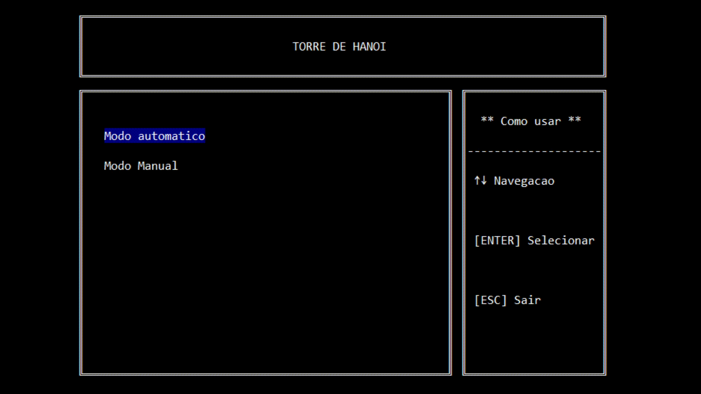

# TorreDeHanoi

Trabalho desenvolvido na materia de Estrutura de dados 1, torre de hanoi é um jogo de quebra cabeça onde existe uma base e tres pinos onde os discos são dispostos, a ideia é que você consiga passar uma torre de discos de um pino para o outro sem que um disco menor fique em baixo de um maior.

## Implementação

Esse trabalho foi feito em c++ utiliando pilhas para a manimulação dos discos, e a lib conio2 para a parte visual

## Participantes

<a href="http://example.com/" target="_blank">Hello, world!</a>

 - [Flavio Roso](https://github.com/FlavioRoso)
 - [Paulo Henrique](https://github.com/barretowski)

## Rodando :D

